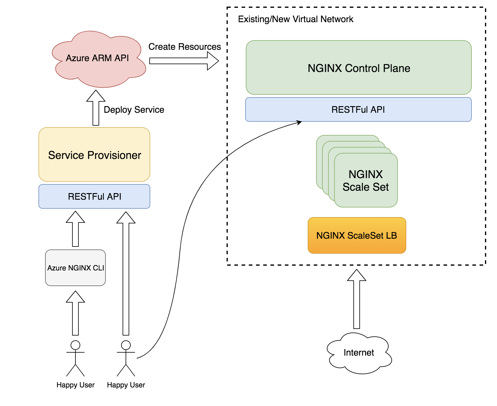

# Azure-NGINX: Deploy self reliant, PaaS-like nginx clusters - WIP

## Overview

azure-nginx allows you to provision highly available nginx clusters on Microsoft Azure, with all the features you'd expect from a fully managed service.
with azure-nginx you get:

* Automatic version upgrades
* Auto healing for nginx nodes
* Auto scaling
* High availability
* Custom VNET deployment
* A self reliant, RESTful API driven Control Plane
* Automatic nginx configuration sync between nodes
* Native Azure CLI integration

azure-nginx is 100% Open Source and *not* an official Azure Service.

This project is the first attempt at creating a reliable development framework to allow for a multitude of Open Source projects to run as self reliant services on Azure.

The core components of azure-nginx will be further generalized for that purpose in the future.

## Usage

azure-nginx provisions ARM resources through the service-provisioner component, which authenticates with Azure using an SPN.

Once you have the SPN details, you can run the service-provisioner and communicate with it either through a RESTful API or the azure-nginx-cli extension.

### Create an SPN

`az ad sp create-for-rbac --sdk-auth > mycredentials.json`

From the output json file you will need clientId, clientSecret, subscriptionId and tenantId.

### Run the service-provisioner using Docker

`docker run -d -p 8080:8080 -e "APP_ID=<your-app-id>" -e "CLIENT_SECRET=<your-client-secret>" -e "TENANT_ID=<your-tenant-id>" -e SUBSCRIPTION_ID="<your-subscription-id>" azurenginx/serviceprovisioner`

### Deploy an nginx cluster with 2 nodes in eastus

`curl -H "Content-Type: application/json" -d '{"name": "mynginxcluster", "nodeSku": "Standard_D1_V2", "nodeCount": 2, "resourceGroup": "my-nginx-rg", "location": "eastus"}' http://localhost:8080/nginx`

### Deploy an nginx cluster in a custom vnet

`curl -H "Content-Type: application/json" -d '{"customSubnetID": "<custom-subnet-id>" "name": "mynginxcluster", "nodeSku": "Standard_D1_V2", "nodeCount": 2, "resourceGroup": "my-nginx-rg", "location": "eastus"}' http://localhost:8080/nginx`

### Deploy using the Azure-CLI extension

The [Azure-CLI extension](https://github.com/azure-nginx/azure-nginx-cli) interacts with the service-provisioner, so make sure its running.

#### Install the cli extension: (Make sure your Azure CLI version is at least 2.0.24)

`az extension add --source 'https://github.com/azure-nginx/azure-nginx-cli/dist/azure_nginx_cli-0.0.1-py2.py3-none-any.whl'`

#### Deploy an nginx cluster with 2 nodes in east us

`az nginx deploy --name "nginxclusterdemo" --resource-group "nginx-rg" --node-count 2 --node-sku "Standard_D1_V2" --location "eastus"`

### deploy in a custom vnet

`az nginx deploy --custom-subnet-id "<id-of-custom-subnet>" --name "nginxclusterdemo" --resource-group "nginx-rg" --node-count 2 --node-sku "Standard_D1_V2" --location "eastus"`

## How it works

